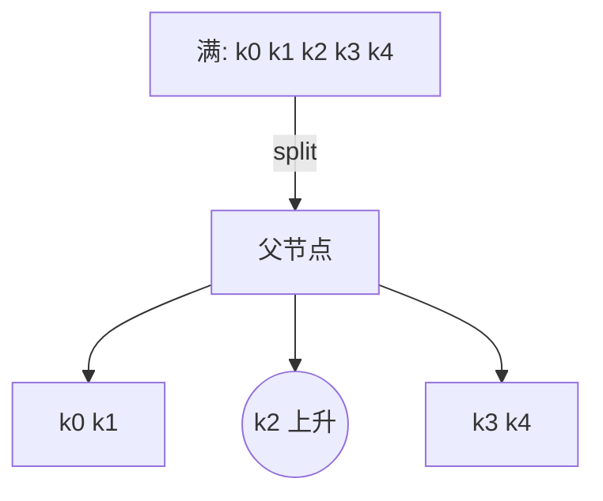

# B树 (B-Tree)

B 树（Balance Tree / 多路平衡查找树）是一种**多路自平衡搜索树**，广泛应用于数据库与文件系统的索引结构。它通过**把大量有序关键字集中在节点中并尽量减少树高度**，在磁盘 / SSD 的块（page）为单位读取场景下显著降低 I/O 次数。

核心目标：在保持有序字典操作 O(log n) 的同时，把树的高度压低，使得一次查询只需极少磁盘访问。

<!-- more -->

## 基本定义与参数

引入两个常见参数：

- 阶 (order) 记为 `m`：一个节点**最多**可以拥有的孩子指针数（即最多 m 个子树）。
- 最小度数 (minimum degree) 记为 `t`：常见教材用 `t`，与阶的关系：`m = 2t` 或 `m = 2t - 1` 取决于不同实现约定。本文采用 **CLRS 定义**：
  - 每个非根节点至少有 `t - 1` 个键，至多 `2t - 1` 个键。
  - 每个非根节点孩子数 ∈ [t, 2t]。
  - 根节点特殊：可以少于 `t - 1`（当根非叶时，至少 1 个键；当全树只有一个节点它可为空）。

记：
- 关键字数量范围：`ceil(m/2) - 1 <= keys(node) <= m - 1`（根除外）
- 孩子指针数：`keys + 1`
- 节点被填满（满节点 / full node）：`keys == m - 1`

> ceil 表示向上取整。

### 节点结构（逻辑）

```text
节点:
  keys[ k1  k2  ...  kk ]  (升序)
  children[ c0 c1 ... ck ]  (k = keys.length)
    所有关键字满足:  c0 < k1 < c1 < k2 < c2 < ... < kk < ck
  leaf 标志: 是否叶子
```

### 有序性不变量
对任一节点：
```
keys 升序
child i 子树的所有键 ∈ (key_{i}, key_{i+1}) 的开区间（边界视为 -∞/+∞）
```

## 查找 (Search)

类似多叉二分：在当前节点内先对 keys 做顺序/二分查找找到区间，再沿对应孩子下降。由于节点内的 `keys` 数量 ≤ `2t - 1`，常用 **顺序查找 + 分支预测 + SIMD** 在内存/页内已经足够快；也可以二分。

时间复杂度：`O(h)` = `O(log_t n)`，磁盘 I/O ≈ 高度 `h`。

## 高度估计

最“胖”结构可把 n 关键字压到极低高度。由最小填充情况求上界：

- 除根外每个节点至少有 `t - 1` 个键；根至少 1 个键（非空）。
- 高度 h（根到叶路径边数）时：
  - 最少关键字数：`n_min(h) = 1 + (t) * (t) * ... * (t) * (t - 1)`（精确推导更规范如下）

更标准推导：高度 h 的最少关键字数 >= `2 * t^{h} - 1` （根最少 1，下一层起每个节点至少 t 个孩子）。

反向解高度：
$$ h \le \log_t \frac{n+1}{2} $$

由于 t 较大（一个页往往能放上百个 key），所以 h 极小（常见 2~4）。

## 插入 (Insert)

核心策略：**自顶向下保证不向满节点“继续下探”**，避免回溯复杂度。

步骤：
1. 若根已满（`2t-1` 键），先分裂根：
   - 创建新节点 `R'` 做新根
   - 旧根分裂为两个节点 + 中间 key 上升
   - 树高度 +1
2. 从（可能更新后的）根开始向下：
   - 对当前节点：找到要下降的 child 索引 i。
   - 如果 child_i 满，先分裂它：
     - 中间键 `mid` 上升插入当前节点 keys 中
     - child 分裂成两个节点（左含前 `t-1` 键，右含后 `t-1` 键）
     - 依据插入的 key 与 `mid` 比较，决定继续走左还是右半部分
3. 到达叶节点后（必非满），在本地数组中插入目标 key（保持有序）。

这样“**双向不回溯**”：所有分裂都在下降途中完成。

### 分裂示意

假设 t = 3（节点最多 5 个键，满时 5 = 2t-1）：

```
满节点: [ k0  k1  k2  k3  k4 ]   (5 keys)
               ^ mid = k2 上升
左节点: [ k0  k1 ]
右节点: [ k3  k4 ]
父插入 k2，并在 k2 左右挂上分裂出的两个孩子。
```

Mermaid（概念化）：


## 删除 (Delete)

删除比插入更繁琐：可能导致节点关键字数量跌破下界 `(t-1)`，需要**借 (borrow)** 或 **合并 (merge)**。同样采用“自顶向下”思想：保证下降到的节点在进入前就至少有 t 个键（从而安全删除其中一个而不至低于 t-1）。

主线：
1. 若根空（无键且有孩子），直接让唯一孩子成为新根（高度 -1）。
2. 从根向下定位 key：对当前节点，确保将要进入的 child 在进入前“够格”。
   - 如果 child 键数 == t-1：
     - 若相邻兄弟有 ≥ t 键：从兄弟“借”一个（通过父节点旋转键）。
     - 否则：与兄弟 + 父中的分隔键合并成一个节点（键数 = 2t-1）。
3. 如果在内部节点命中要删的 key：
   - 用前驱（左子树最大）或后继（右子树最小）替换，然后递归删除该替换位置的 key。
   - 或者：若左右子树之一可安全删除直接选路径（实现者策略差异）。
4. 若在叶子命中：直接删除（此时必满足叶节点 ≥ t 键或下降前已调整）。

### 借与合并图解 (t = 3)

借（兄弟有富余）：
```
父:      [   Kp   ]
        /          \
左子: [a b]   右子: [ d e f g ]  (右子 >= t=3 键)
-- 借一个：右子最左 d 上升为 Kp，Kp 下沉到左子
父:      [   d   ]
       /          \
左子: [a b Kp] 右子:[ e f g ]
```

合并（兄弟都仅 t-1 键）：
```
父:      [   Kp   x ...]
        /     \
左:[a b] 右:[ c d ]  (皆2 = t-1)
-- 合并:
新节点: [ a b Kp c d ] (5 = 2t-1 满)
父删除 Kp 并去掉右指针
```

## 与二叉平衡树 (AVL / RBT) 对比

| 维度 | B 树 | 红黑树 | AVL |
| ---- | ---- | ------ | ---- |
| 分支因子 | 多路 (几十~上千) | 2 | 2 |
| 高度 | 极低 (2~4 常见) | O(log n) 较小 | O(log n) 更严格 |
| 适用存储 | 磁盘 / SSD / Page Cache | 内存 | 内存 |
| 旋转/结构调整 | 分裂 / 合并 / 借 | 单/双旋 + 变色 | 频繁旋转 |
| 查找常数因子 | 少层 + 节点内顺序/二分 | 多层 | 多层 |
| 插入/删除复杂度 | O(log_t n) | O(log n) | O(log n) |
| 典型应用 | DB 索引、文件系统 | 语言库 map/set | 内存频繁查找 |

## 设计动机与磁盘友好性

- 一个页 4KB，若每个 key+指针 16B，可放 ~256 key（t ≈ 128）。
- 高度估算：百万级数据 `n=1e6`：`h ≤ log_128((1e6+1)/2) ≈ 3.x`，I/O 仅 3~4 次。
- 利用**局部性**：一个节点内连续 keys 顺序存放，CPU 缓存与预取友好。

## 常见误区

| 误区 | 更正 |
| ---- | ---- |
| B 树 = B-树 = B+ 树 | B+ 树是 B 树的变体（所有数据只在叶子，链表串联叶子）。|
| 插入必须回溯分裂 | 标准实现自顶向下：先分裂满子节点再下降。|
| 删除一定很难实现 | 关键在“进入前保证 child >= t”。|
| t 越大越好 | 过大导致节点内查找代价上升；需权衡页大小/CPU 缓存。|
| B 树节点一定全满 | 只要求范围约束；满只是极端。|
