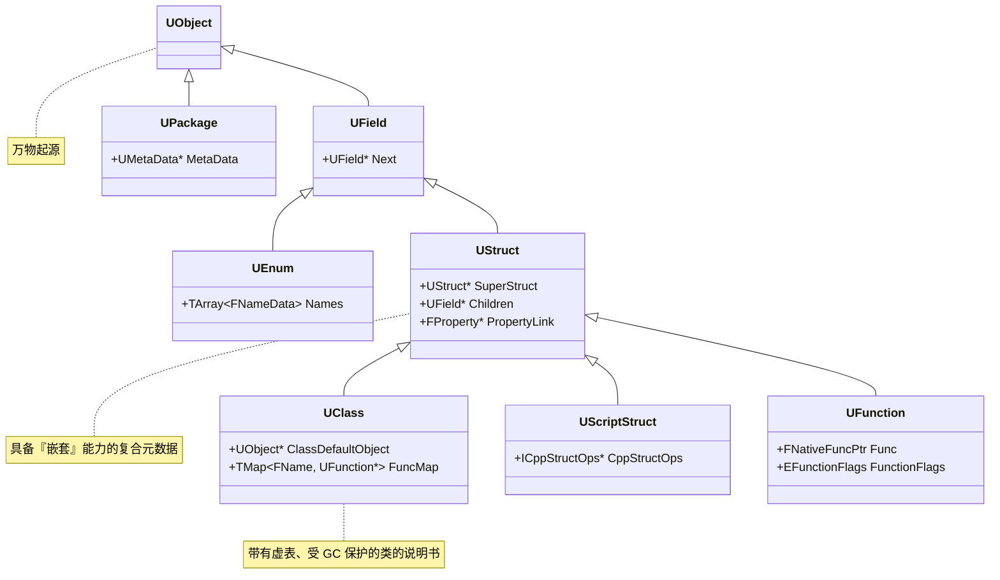
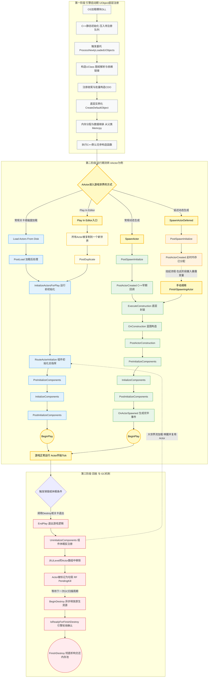

# 前言

`UObeject` 算是 UE5 的万物起源了，几乎所有的东西都是由 `UObject` 派生的。

- 提供元数据
- 反射生成
- GC垃圾回收
- 序列化
- 编辑器可见

[UE5 源码参考](https://github.com/EpicGames/UnrealEngine)

<!-- more -->

## UObject 继承树

万物继承自 `UObject` 是虚幻引擎内存管理（GC）、序列化和反射体系的基石。所有 `U` `A` 开头的类都继承自它，从而接入了引擎的底层生态。构成反射系统的一个个 “**模块**” （`UField`、`UStruct`、`UClass` 等） 都是 `UObject` 的子类，形成了一个庞大的继承树。



### 类的诞生流程

1. 编译期扫描（UHT）
   UHT (Unreal Header Tool) 并不在内存中创建对象，而是扫描 `.h` 文件中的宏定义 (`UCLASS`、`UFUNCTION` 等)
2. 生成反射数据
   扫描后，UHT 自动生成对应的 `.gen.cpp` 文件，文件中包含了类中每个成员 **偏移量、参数大小** 等数据。  
    - 在 `UFUNCTION` 宏标记的成员上，UHT 将其成员（包括输入及返回值）构造成一个结构体（Z开头），并将偏移量存入到结构体内部的 `FuncParams` 中。`FuncParams` 传给 `ConstructUFunction`，最终构建出一个 `UFunction` 对象。
    ```cpp
    // ********** Begin Function ShowSniperScopeWidget Property Definitions ****************************
    void Z_Construct_UFunction_ABlasterCharacter_ShowSniperScopeWidget_Statics::NewProp_bShowScope_SetBit(void* Obj)
    {
        ((BlasterCharacter_eventShowSniperScopeWidget_Parms*)Obj)->bShowScope = 1;
    }
    const UECodeGen_Private::FBoolPropertyParams Z_Construct_UFunction_ABlasterCharacter_ShowSniperScopeWidget_Statics::NewProp_bShowScope = { "bShowScope", nullptr, (EPropertyFlags)0x0010000000000080, UECodeGen_Private::EPropertyGenFlags::Bool | UECodeGen_Private::EPropertyGenFlags::NativeBool, RF_Public|RF_Transient|RF_MarkAsNative, nullptr, nullptr, 1, sizeof(bool), sizeof(BlasterCharacter_eventShowSniperScopeWidget_Parms), &Z_Construct_UFunction_ABlasterCharacter_ShowSniperScopeWidget_Statics::NewProp_bShowScope_SetBit, METADATA_PARAMS(0, nullptr) };
    const UECodeGen_Private::FPropertyParamsBase* const Z_Construct_UFunction_ABlasterCharacter_ShowSniperScopeWidget_Statics::PropPointers[] = {
        (const UECodeGen_Private::FPropertyParamsBase*)&Z_Construct_UFunction_ABlasterCharacter_ShowSniperScopeWidget_Statics::NewProp_bShowScope,
    };
    static_assert(UE_ARRAY_COUNT(Z_Construct_UFunction_ABlasterCharacter_ShowSniperScopeWidget_Statics::PropPointers) < 2048);
    // ********** End Function ShowSniperScopeWidget Property Definitions ******************************
    const UECodeGen_Private::FFunctionParams Z_Construct_UFunction_ABlasterCharacter_ShowSniperScopeWidget_Statics::FuncParams = { { (UObject*(*)())Z_Construct_UClass_ABlasterCharacter, nullptr, "ShowSniperScopeWidget", 	Z_Construct_UFunction_ABlasterCharacter_ShowSniperScopeWidget_Statics::PropPointers, 
        UE_ARRAY_COUNT(Z_Construct_UFunction_ABlasterCharacter_ShowSniperScopeWidget_Statics::PropPointers), 
    sizeof(BlasterCharacter_eventShowSniperScopeWidget_Parms),
    RF_Public|RF_Transient|RF_MarkAsNative, (EFunctionFlags)0x08020800, 0, 0, METADATA_PARAMS(UE_ARRAY_COUNT(Z_Construct_UFunction_ABlasterCharacter_ShowSniperScopeWidget_Statics::Function_MetaDataParams), Z_Construct_UFunction_ABlasterCharacter_ShowSniperScopeWidget_Statics::Function_MetaDataParams)},  };
    static_assert(sizeof(BlasterCharacter_eventShowSniperScopeWidget_Parms) < MAX_uint16);
    UFunction* Z_Construct_UFunction_ABlasterCharacter_ShowSniperScopeWidget()
    {
        static UFunction* ReturnFunction = nullptr;
        if (!ReturnFunction)
        {
            UECodeGen_Private::ConstructUFunction(&ReturnFunction, Z_Construct_UFunction_ABlasterCharacter_ShowSniperScopeWidget_Statics::FuncParams);  // FuncParams 为前面构造的参数结构体，里面包含了参数、大小、偏移量等信息
        }
        return ReturnFunction;
    }
    ```

    此外，UHT 还会为纯蓝图实现的函数通过 `ProcessEvent` 接口来让C++访问。顺带一提，RPC 拦截器拦截到需网络同步的函数时，也会通过这种方式来找反射表中的函数进行调用。
    ```cpp
    struct BlasterCharacter_eventShowSniperScopeWidget_Parms
    {
        bool bShowScope;
    };
    void ABlasterCharacter::ShowSniperScopeWidget(bool bShowScope)
    {
        BlasterCharacter_eventShowSniperScopeWidget_Parms Parms;
        Parms.bShowScope=bShowScope ? true : false;
        UFunction* Func = FindFunctionChecked(NAME_ABlasterCharacter_ShowSniperScopeWidget);
        ProcessEvent(Func,&Parms);
    }
    ```
    - 对于 `UCLASS` 和 `USTRUCT`，UHT 不会为它们生成额外的包装结构体。因为它们的内存布局（占用字节、成员顺序）在 C++ 编译时就已固定。UHT 仅利用 STRUCT_OFFSET 宏，提取并记录每个 UPROPERTY 相对于对象首地址的内存偏移量。运行时引擎直接依靠这些偏移量进行内存寻址。
3. 当引擎启动时，开始执行这些 `.gen.cpp` 代码。实例化 `UFucntion`、`UClass` 等反射对象，将它们串联成树（建立继承链和属性链表）。在这个过程中，构建类本身的构造函数包装器也会被记录下来。当 `UClass` 实例完全被创建出来后，引擎再通过 `UClass` 中记录的信息实例化 **类本身这个实体** （即创建 CDO 对象）。

## UObject 生命周期



## 反射系统

## GC

## 序列化

