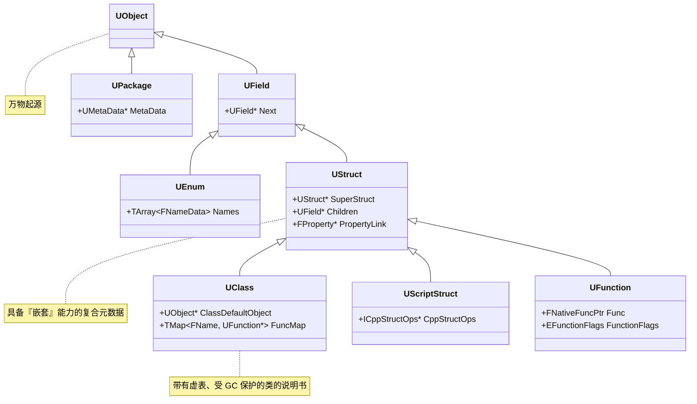
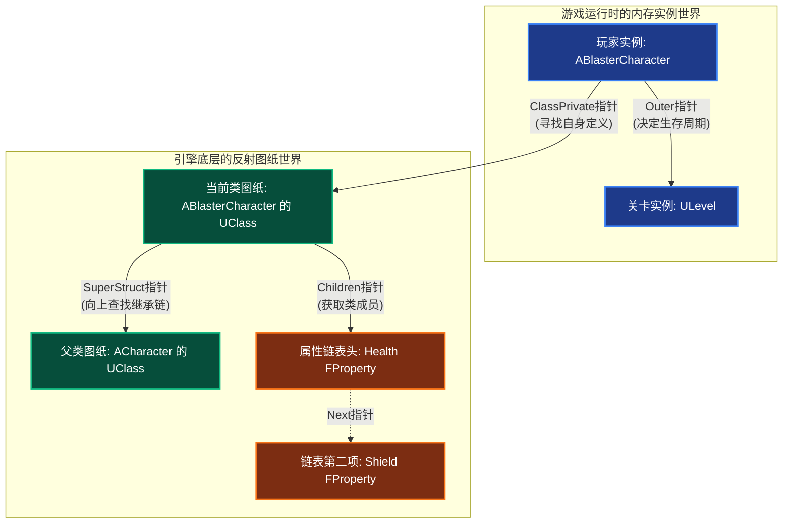

# 前言

`UObeject` 算是 UE5 的万物起源了，几乎所有的东西都是由 `UObject` 派生的。

- 提供元数据
- 反射生成
- GC垃圾回收
- 序列化
- 编辑器可见

[UE5 源码参考](https://github.com/EpicGames/UnrealEngine)

<!-- more -->

## UObject 继承树

首先是总览：

## UObject 生命周期

## 反射系统

## GC

## 序列化

