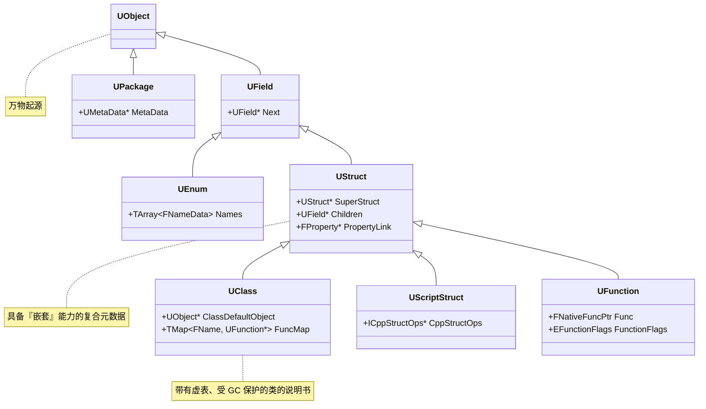

# 前言

`UObeject` 算是 UE5 的万物起源了，几乎所有的东西都是由 `UObject` 派生的。

- 提供元数据
- 反射生成
- GC垃圾回收
- 序列化
- 编辑器可见

[UE5 源码参考](https://github.com/EpicGames/UnrealEngine)

<!-- more -->

## UObject 继承树

万物继承自 `UObject` 是虚幻引擎内存管理（GC）、序列化和反射体系的基石。所有 `U` `A` 开头的类都继承自它，从而接入了引擎的底层生态。构成反射系统的一个个 “**模块**” （`UField`、`UStruct`、`UClass` 等） 都是 `UObject` 的子类，形成了一个庞大的继承树。



### 类的诞生流程

1. 编译期扫描（UHT）
   UHT (Unreal Header Tool) 并不在内存中创建对象，而是扫描 `.h` 文件中的宏定义 (`UCLASS`、`UFUNCTION` 等)
2. 生成反射数据
   扫描后，UHT 自动生成对应的 `.gen.cpp` 文件，文件中包含了类中每个成员 **偏移量、参数大小** 等数据。  
    - 在 `UFUNCTION` 宏标记的成员上，UHT 将其成员（包括输入及返回值）构造成一个结构体（Z开头），并将偏移量存入到结构体内部的 `FuncParams` 中。`FuncParams` 传给 `ConstructUFunction`，最终构建出一个 `UFunction` 对象。
    ```cpp
    // ********** Begin Function ShowSniperScopeWidget Property Definitions ****************************
    void Z_Construct_UFunction_ABlasterCharacter_ShowSniperScopeWidget_Statics::NewProp_bShowScope_SetBit(void* Obj)
    {
        ((BlasterCharacter_eventShowSniperScopeWidget_Parms*)Obj)->bShowScope = 1;
    }
    const UECodeGen_Private::FBoolPropertyParams Z_Construct_UFunction_ABlasterCharacter_ShowSniperScopeWidget_Statics::NewProp_bShowScope = { "bShowScope", nullptr, (EPropertyFlags)0x0010000000000080, UECodeGen_Private::EPropertyGenFlags::Bool | UECodeGen_Private::EPropertyGenFlags::NativeBool, RF_Public|RF_Transient|RF_MarkAsNative, nullptr, nullptr, 1, sizeof(bool), sizeof(BlasterCharacter_eventShowSniperScopeWidget_Parms), &Z_Construct_UFunction_ABlasterCharacter_ShowSniperScopeWidget_Statics::NewProp_bShowScope_SetBit, METADATA_PARAMS(0, nullptr) };
    const UECodeGen_Private::FPropertyParamsBase* const Z_Construct_UFunction_ABlasterCharacter_ShowSniperScopeWidget_Statics::PropPointers[] = {
        (const UECodeGen_Private::FPropertyParamsBase*)&Z_Construct_UFunction_ABlasterCharacter_ShowSniperScopeWidget_Statics::NewProp_bShowScope,
    };
    static_assert(UE_ARRAY_COUNT(Z_Construct_UFunction_ABlasterCharacter_ShowSniperScopeWidget_Statics::PropPointers) < 2048);
    // ********** End Function ShowSniperScopeWidget Property Definitions ******************************
    const UECodeGen_Private::FFunctionParams Z_Construct_UFunction_ABlasterCharacter_ShowSniperScopeWidget_Statics::FuncParams = { { (UObject*(*)())Z_Construct_UClass_ABlasterCharacter, nullptr, "ShowSniperScopeWidget", 	Z_Construct_UFunction_ABlasterCharacter_ShowSniperScopeWidget_Statics::PropPointers, 
        UE_ARRAY_COUNT(Z_Construct_UFunction_ABlasterCharacter_ShowSniperScopeWidget_Statics::PropPointers), 
    sizeof(BlasterCharacter_eventShowSniperScopeWidget_Parms),
    RF_Public|RF_Transient|RF_MarkAsNative, (EFunctionFlags)0x08020800, 0, 0, METADATA_PARAMS(UE_ARRAY_COUNT(Z_Construct_UFunction_ABlasterCharacter_ShowSniperScopeWidget_Statics::Function_MetaDataParams), Z_Construct_UFunction_ABlasterCharacter_ShowSniperScopeWidget_Statics::Function_MetaDataParams)},  };
    static_assert(sizeof(BlasterCharacter_eventShowSniperScopeWidget_Parms) < MAX_uint16);
    UFunction* Z_Construct_UFunction_ABlasterCharacter_ShowSniperScopeWidget()
    {
        static UFunction* ReturnFunction = nullptr;
        if (!ReturnFunction)
        {
            UECodeGen_Private::ConstructUFunction(&ReturnFunction, Z_Construct_UFunction_ABlasterCharacter_ShowSniperScopeWidget_Statics::FuncParams);  // FuncParams 为前面构造的参数结构体，里面包含了参数、大小、偏移量等信息
        }
        return ReturnFunction;
    }
    ```

    此外，UHT 还会为纯蓝图实现的函数通过 `ProcessEvent` 接口来让C++访问。顺带一提，RPC 拦截器拦截到需网络同步的函数时，也会通过这种方式来找反射表中的函数进行调用。
    ```cpp
    struct BlasterCharacter_eventShowSniperScopeWidget_Parms
    {
        bool bShowScope;
    };
    void ABlasterCharacter::ShowSniperScopeWidget(bool bShowScope)
    {
        BlasterCharacter_eventShowSniperScopeWidget_Parms Parms;
        Parms.bShowScope=bShowScope ? true : false;
        UFunction* Func = FindFunctionChecked(NAME_ABlasterCharacter_ShowSniperScopeWidget);
        ProcessEvent(Func,&Parms);
    }
    ```
    - 对于 `UCLASS` 和 `USTRUCT`，UHT 不会为它们生成额外的包装结构体。因为它们的内存布局（占用字节、成员顺序）在 C++ 编译时就已固定。UHT 仅利用 STRUCT_OFFSET 宏，提取并记录每个 UPROPERTY 相对于对象首地址的内存偏移量。运行时引擎直接依靠这些偏移量进行内存寻址。
3. 当引擎启动时，开始执行这些 `.gen.cpp` 代码。实例化 `UFucntion`、`UClass` 等反射对象，将它们串联成树（建立继承链和属性链表）。在这个过程中，构建类本身的构造函数包装器也会被记录下来。当 `UClass` 实例完全被创建出来后，引擎再通过 `UClass` 中记录的信息实例化 **类本身这个实体** （即创建 CDO 对象）。

## UObject 生命周期

`UObject` 的生命周期可以划分为三个大的阶段，而不仅仅只是 `BeginPlay` -> `Tick` -> `Destroy`

1. 引擎启动期（UObject 底层注册与 CDO 构造）
   此时游戏世界（World）还未创建，这个阶段主要是完成反射数据的收集以及默认模板的创建。  
    - UClass 构造与注册：引擎运行由 UHT生成的 `.gen.cpp` 文件，构造出一个个 `UClass` 对象，并将它们注册到全局反射系统中。
    - CDO 构造：在 `UClass` 注册完成后，底层会调用 `CreateDefaultObject` 来实例化 CDO（Class Default Object）。CDO 是一个特殊的对象，作为该类的默认模板存在。它会调用 C++ 的默认无参构造函数来进行初始化，但此时游戏世界还未创建，因此无法访问任何与游戏运行相关的功能。
   :::warning
    因此，**绝对不能在 C++ 构造函数中调用 `GetWorld()` 或其它与游戏运行期相关的逻辑（生成特效、寻路等）。** CDO 在创建时游戏还未启动，调用时必会触发空指针。只允许进行组件创建（`CreateDefaultSubobject`）和变量赋初始值。
   :::
2. 运行期流转（以 AActor 为例）
   当调用 `NewObject` 或 `SpawnActor` 时，对象正式进入游戏世界。根据应用场景，有三种方式来生成 Actor ：
   - 关卡加载（从磁盘中加载）：通过序列化数据反序列化恢复状态，随后由 `RouteActorInitialize` 统筹所有组件的物理和渲染注册。用于直接将 Actor 放在关卡中，或通过流加载动态加载关卡时。
   - 常规动态生成：底层通过 `ExecuteConstruction` 跨界调用蓝图的 `Construction Script`，随后进入组件初始化，最终抛出 `OnActorSpawned` 并执行 `BeginPlay`。
   这种方式适用于游戏运行时动态生成 Actor 的场景，如玩家通过某个交互生成一个道具，往往这种 Actor 不需要外部传参，直接生成。
   - 延迟动态生成：常规生成的特殊方式。引擎在分配完内存、完成早期 C++ 回调（`PostActorCreated`）后会 **强制挂起（暂停）** 生成流程，返回一个半成品指针。此时开发者可以安全地对其“暴露的变量（Expose On Spawn）”进行赋值。赋值完成后，必须手动调用 `FinishSpawningActor`，引擎才会放行，让它继续走完蓝图构造和 BeginPlay。  
   这种方式适用于 **需要在生成时传入参数的场景** ，如玩家通过某个交互生成一个道具，但这个道具的属性（类型、颜色等）需要根据玩家的选择来定。
3. 毁灭、休眠与回收（GC）
   - 调用 `Destroy()` 后，Actor 会执行 `EndPlay()` 退出游戏逻辑循环，剥离组件。
   `EndPlay()` 一般用于委托解绑、停止计时器、游戏业务结算以及视效、音效与物理的停止。`EndPlay()` 还会获取到 **停止原因 `EEndPlayReason::Type`** ，可以根据不同停止原因来做不同的处理（如 `Destroyed` 代表正常销毁，`LevelTransition` 代表关卡切换，`Quit` 代表退出游戏等）。

   - 底层异步GC。确定不再需要的对象会被标记为垃圾（`RF_PendingKill`），等待下一次 GC 扫描周期。GC 会调用 `BeginDestroy()` 来异步释放原生资源，随后轮询 `IsReadyForFinishDestroy()` 来确认是否可以彻底析构（`FinishDestroy()`）并回收内存。

```mermaid
graph TD
    subgraph Phase1 [第一阶段 引擎启动期 UObject底层注册]
        A[OS加载模块DLL] --> B[C++静态初始化 压入待注册队列]
        B --> C[触发委托 ProcessNewlyLoadedUObjects]
        C --> D1[StaticAllocateObject 开辟新内存，原地构造 UClass 类模板，并建立依赖链接]
        D1 --> D2[注册收尾管线 UObjectLoadAllCompiledInDefaultProperties] 
        D2 --> E[内部循环调用底层 API: CreateDefaultObject]
        E --> F[懒加载父类 CDO ，StaticAllocateObject 开辟新内存，并原地构造新的 CDO 实例]
        F --> G[执行C++默认无参构造函数 伴随父类构造栈]
        G --> H[FObjectInitializer接管 根据反射安全深拷贝父类属性]
    end

    H --> I{AActor进入游戏世界的方式}

    subgraph Phase2 [第二阶段 运行期流转 AActor为例]
        I -->|常规关卡或磁盘加载| L[Load Actors From Disk]
        L --> M[PostLoad 加载后处理]
        M --> N[InitializeActorsForPlay 运行前初始化]
        N --> S0[RouteActorInitialize 组件初始化总指挥]
        S0 --> SL[PreInitializeComponents]
        SL --> TL[InitializeComponents]
        TL --> UL[PostInitializeComponents]
        UL --> VL((BeginPlay))

        I -->|Play In Editor| PIE1[Play In Editor入口]
        PIE1 --> PIE2[所有Actor被复制到一个新世界]
        PIE2 --> PIE3[PostDuplicate]
        PIE3 --> N

        I -->|常规动态生成| J[SpawnActor]
        J --> O[PostSpawnInitialize]
        O --> O1[PostActorCreated C++早期回调]
        O1 --> O2[ExecuteConstruction 底层封装]
        O2 --> P[OnConstruction 蓝图构造]
        P --> P1[PostActorConstruction]
        P1 --> SS[PreInitializeComponents]
        SS --> TS[InitializeComponents]
        TS --> US[PostInitializeComponents]
        US --> V1[OnActorSpawned 生成完毕事件]
        V1 --> VS((BeginPlay))

        I -->|延迟动态生成| K[SpawnActorDeferred]
        K --> Q1[PostSpawnInitialize]
        Q1 --> Q2[PostActorCreated 此时内存已分配]
        Q2 -.->|挂起流程 在此阶段塞入暴露变量| R[手动调用FinishSpawningActor]
        R --> O2

        VL --> W[游戏正常运行 Actor开始Tick]
        VS --> W
    end

    W --> X{触发销毁或休眠条件}

    subgraph Phase3 [第三阶段 回收 与 GC机制]
        X -->|调用Destroy或关卡退出| Y[EndPlay 退出游戏逻辑]
        Y --> Z[UninitializeComponents 组件休眠反注册]

        %% 核心改动：先声明向下走的主线，让引擎优先排布
        Z --> AA[从ULevel的Actor数组中移除]
        AA --> AB[Actor被标记为垃圾 RF PendingKill]
        
        %% 后声明向上的虚线，诱导引擎向左侧避让
        Z -.->|大世界流加载 唤醒并复用Actor| S0
        
        AB -.->|等待下一次GC扫描周期| AC[BeginDestroy 异步释放原生资源]
        AC --> AD[IsReadyForFinishDestroy 引擎轮询确认]
        AD --> AE((FinishDestroy 彻底析构交还内存池))
    end
    
    classDef phase1 fill:#f8f9fa,stroke:#adb5bd,stroke-width:2px,color:#000;
    classDef loadBranch fill:#e3f2fd,stroke:#64b5f6,stroke-width:2px,color:#000;
    classDef pieBranch fill:#fffde7,stroke:#fbc02d,stroke-width:2px,color:#000;
    classDef spawnBranch fill:#e8f5e9,stroke:#81c784,stroke-width:2px,color:#000;
    classDef deferBranch fill:#fff3e0,stroke:#ffb74d,stroke-width:2px,color:#000;
    classDef destroyPhase fill:#ffebee,stroke:#e57373,stroke-width:2px,color:#000;
    classDef milestone fill:#fff9c4,stroke:#fbc02d,stroke-width:3px,color:#000;

    class A,B,C,D,E,F,G,H phase1;
    class L,M,N,S0,SL,TL,UL loadBranch;
    class PIE1,PIE2,PIE3 pieBranch;
    class J,O,O1,O2,P,P1,SS,TS,US,V1 spawnBranch;
    class K,Q1,Q2 deferBranch;
    class Y,Z,AA,AB,AC,AD,AE destroyPhase;
    class I,J,K,R,VL,VS,W,PIE1 milestone;
```




:::tip StaticAllocateObject
`StaticAllocateObject` 除了分配内存，还会向全局对象大数组 `GUObjectArray`（由 `FUObjectArray` 驱动）申请一个全局唯一的 `InternalIndex` （对象索引），即将分配出来的内存注册到引擎的对象管理系统中。这个索引在对象的整个生命周期内保持不变，成为引擎内部追踪和管理该对象的关键标识。

普通的 `malloc` 分配的内存容易产生**内存碎片**，而 `StaticAllocateObject` 则是对接自己的内存池。在引擎启动时，引擎会预先分配一大块连续的内存作为 `UObject` 的内存池。每当需要创建一个新的 `UObject` 时，`StaticAllocateObject` 就会从这个内存池中分配一块内存，并返回给调用者。

`StaticAllocateObject` 在分配出内存后，会立刻在底层调用 `FMemory::Memzero`。它强制将这块内存的每一个字节全部抹零。这为后续的 Placement New（原地构造）和 `FObjectInitializer` 属性拷贝提供了绝对纯净的内部环境，确保对象的初始状态完全可预测，避免了未初始化内存可能带来的不确定行为。

同时，`StaticAllocateObject` 会精准地把对象的 `FName`（名字）、`Outer`（所属的外部对象/包）、`UClass*` 以及 `EObjectFlags`（`UObject` 标志位，如 RF_Public, RF_ClassDefaultObject）直接刻录到这块内存的头部结构中。

**一句话总结：**   
`StaticAllocateObject` 的作用： `StaticAllocateObject` 使用引擎自带的 `FUObjectArray` 分块内存池来分配内存，且为 **GC 系统的前置约束**，分配内存的同时强制在全局大名单注册 `InternalIndex`。最后，它通过 `FMemory::Memzero` 保证内存纯净，并提前注入了 `Outer` `、Name` 和 `Flags` 等元数据。
:::

:::tip 原地构造
在引擎启动期，UClass 的构造过程采用了 **原地构造** 的方式。引擎先通过 `StaticAllocateObject` 开辟一块内存，然后引擎使用 C++ 的 **定位 `new (Placement New)` ** 特性 —— 例如 `new(AllocatedMemory) UClass(...)` 来指定在刚刚开辟的内存中构建对象。

这种设计将 **“内存分配”** 与 **“对象构造”** 完美解耦，从而让 `UObject` 的内存池复用、GC 垃圾回收完全由虚幻引擎底层接管，而不再受制于操作系统的堆分配。
:::

## 反射系统

在上文的 [生命周期](#uobject-生命周期) 中 已经或多或少提到过反射系统了。反射系统就是由 `UObject` 的子类（`UField`、`UStruct`、`UClass` 等）构成的一套庞大的类体系。它为引擎提供了运行时类型信息、动态调用和序列化的能力。

## GC

## 序列化

