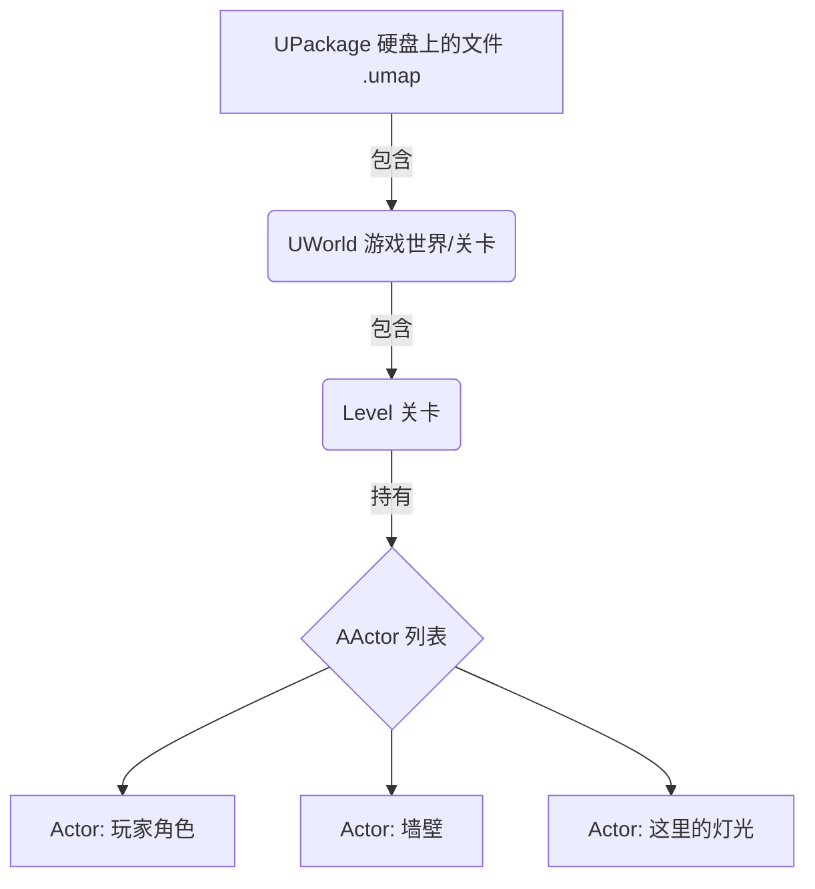

# UE5前置知识

在使用 UE5 之前需要学习的一些前置知识。

<!-- more -->

## 光照系统

UE5 的光照组件可以分为： **自然环境组** 和 **人工光源组**
- **自然环境组：**
  - **Directional Light（定向光）**：模拟太阳光/月光，照亮整个场景，到达场景的所有光线都是 **平行** 的。
  - **Sky Light（天空光）**：模拟天空的漫反射光，补充阴影部分的光照。
  - **Atmospheric Fog（大气雾）**：模拟大气散射效果，增强远处物体的层次感。
  - **Sky Atmosphere（天空大气）**：用于创建逼真的天空和大气效果。
  - **Volumetric Clouds（体积云）**：用于创建逼真的云层效果。
- **人工光源组：**
  - **Point Light（点光源）**：从一个点向各个方向发射光线，类似灯泡。
  - **Spot Light（聚光灯）**：从一个点向一个方向发射光线，类似手电筒。
  - **Rect Light（矩形光源）**：从一个矩形区域发射光线，适合模拟窗户或荧光灯。

## 字面量转换

在 UE5 编程中需要使用宏 [`TEXT()`](https://dev.epicgames.com/documentation/en-us/unreal-engine/epic-cplusplus-coding-standard-for-unreal-engine#generalstyleissues) 来将字符串字面量转换为 UE5 的 **Unicode** 字符串类型 `FString` 或 `FName`，以此避免不必要的编码转换。

## UE5 的核心继承树

> 继承时不要忘记把父类的函数也调用一下，因为本质上 **只是扩展父类的功能**。

下面的四种类型是 UE5 中最常用的四个核心类，每个类都有许多不同的派生类：
- **UObject**: 所有 UE5 对象的基类，提供了 **内存管理** 、 **垃圾回收** 等功能。 （不能放置）
- **AActor**: 继承自 UObject，是游戏世界中的实体对象，可以放置在关卡中。
- **APawn**: 继承自 AActor，是可以被“控制”的物体（比如载具、非人型生物）。
- **ACharacter**: 继承自 APawn，专门用于表示具有行走、跳跃等动作的角色，内置了角色运动组件。

## UE5 的包含体系

UE5 的包含体系也就是 UE5 管理资源的方式，主要是外部类及内部类的关系：
- **Package**: UE5 中的所有资源文件，可以理解成一个文件夹，包含了多个资源对象。
- **World**: 中间层，包含关卡（Level）和子关卡（Sublevel）。
- **Level**: 关卡，包含了场景中的所有 Actor 及 Actor 的组件。
  



## UE5 反射体系

在 UE5 引擎中，如果一个对象参与垃圾回收，系统就会追踪有多少变量在引用它。如果没有变量引用它，那这个对象就自动删掉了。如果在普通的 C++ 中，垃圾回收是自己实现的，如果自己忘记了就会造成**内存泄漏**。

UE5 引擎的类声明顶部有个 `UCLASS()` 宏，用于所有继承自 `UObject` 的类，这样每个类就能参与反射系统，参与了垃圾回收。

同理，要让变量和函数也参与到反射系统中，就得分别用 `UPROPERTY()` 和 `UFUNCTION()` 宏来声明。
- `UPROPERTY()`：用于声明类中的变量，使其能够被引擎识别和管理。
- `UFUNCTION()`：用于声明类中的函数，使其能够被引擎识别和调用。

```C++
UCLASS()
class AMyActor : public AActor
{
    GENERATED_BODY()
    
    UPROPERTY()
    UStaticMesh SwordMesh; // 参与反射系统的变量

    UFUNCTION()
    void Attack(); // 参与反射系统的函数
};
```
通过这些宏，才能够将这些变量和函数暴露给蓝图。

另外，使用反射系统的类一般都要包含头文件： `className.generated.h`

宏也可以传参数进去来改变宏的一些行为，从而改变变量和函数是如何暴露给蓝图的。

## 根组件

根组件（Root Component）是每个 Actor 的基础组件，所有其他组件都是附加在根组件上的。根组件定义了 Actor 在世界中的位置、旋转和缩放。

创建的 C++ Actor 类默认没有根组件，通过蓝图继承的 C++ Actor 类会自动创建一个 `DefaultSceneRoot` 作为根组件。

有根组件才能够**拖动 Actor、旋转 Actor 和缩放 Actor**。

## FString 的运算符重载

[`FString`](https://dev.epicgames.com/documentation/en-us/unreal-engine/API/Runtime/Core/FString#operators) 类重载了一些运算符，使得字符串操作更加方便：
- `+` 运算符：用于连接两个 `FString` 对象，返回一个新的 `FString` 对象。
- `==` 运算符：用于比较两个 `FString` 对象是否相等，返回一个布尔值。
- `!=` 运算符：用于比较两个 `FString` 对象是否不相等，返回一个布尔值。
- `*` 运算符：返回一个字符数组，也就是 C 风格的字符串。

```C++
FString Str1 = TEXT("Hello, ");
FString Str2 = TEXT("World!");
FString Str3 = Str1 + Str2; // Str3 现在是 "Hello, World!"
FString Name = TEXT("UE5");
FString::Printf(TEXT("ItemName: %s"), *Name);
```

## GEngine

`GEngine` 是一个全局指针，管理引擎的核心功能。通过 `GEngine`，可以访问引擎的各种子系统，例如渲染、音频、输入等。

为了防止崩溃，在使用 `GEngine` 之前，最好先检查它是否为 `nullptr`。

```C++
if (GEngine)
{
    GEngine->AddOnScreenDebugMessage(-1, 5.f, FColor::Red, TEXT("Hello, UE5!"));
}
```
如果指向空 (nullptr)： 则说明引擎还没有启动或已被销毁。

## 几个 DEBUG 可视化

在虚幻引擎中，使用 `DrawDebugHelpers.h` 提供的函数可以在场景中绘制可视化的调试图形，用于辅助判断逻辑（如射线检测、范围判定、向量方向等）。

```C++
DrawDebugXXXX(GetWorld(), .......);
```

- `DrawDebugLine`：绘制一条线段。可以表示物体的行进方向或射线。
- `DrawDebugBox`：绘制一个立方体。可以表示物体的边界框或碰撞体积。
- `DrawDebugCylinder`：绘制一个圆柱体。可以表示物体的范围或路径。
- `DrawDebugSphere`：绘制一个球体。可以绘制隐藏的物体位置或范围。
- `DrawDebugPoint`：绘制一个点。可以表示特定位置，或者射线的箭头，通常用于标记射线检测的击中点，它在屏幕上显示为一个正方形的小块。

| 参数名 | 类型 | 说明 | 推荐值 |
| :--- | :--- | :--- | :--- |
| **bPersistentLines** | `bool` | 是否永久保留。如果为 true，画出来的东西永远不消失（除非手动 Flush）。 | `false` |
| **LifeTime** | `float` | 存活时间（秒）。如果是 -1，则只显示一帧（用于 Tick 中实时刷新）。 | `2.0f` (调试时) / `-1.f` (Tick中) |
| **Segments** | `int32` | (仅球体) 面数/段数。决定球体有多圆。 | `12` 或 `24` |
| **Thickness** | `float` | (仅线/球) 线条的厚度。 | `1.0f` |
| **DepthPriority** | `uint8` | 深度优先级。决定是否被物体遮挡。0 表示会被墙挡住，1 表示透视显示。 | `0` |

## 几种向量
在 UE5 中，常用的向量类型有以下几种：
- `FVector`：三维向量，表示空间中的位置或方向，包含 X、Y、Z 三个分量。
- `FVector2D`：二维向量，表示平面上的位置或方向，包含 X、Y 两个分量。
- `FVector4`：四维向量，通常用于表示齐次坐标或颜色，包含 X、Y、Z、W 四个分量。
- `FRotator`：表示旋转，包含俯仰角（Pitch）、偏航角（Yaw）、滚转角（Roll）三个分量。
- `FQuat`：四元数，用于表示旋转，避免万向锁问题。
  ::: danger 万向锁
  万向锁（Gimbal Lock）是指在使用欧拉角表示旋转时，某些旋转组合会导致一个自由度的丧失，从而无法表示某些旋转状态。四元数通过使用四个分量来表示旋转，避免了这种问题。

  欧拉角变换是**从初始坐标系开始，依次绕固定的轴旋转指定的角度**。

  由于欧拉角是设定了三个轴的变换顺序，内部的轴无法带动外部的轴旋转，因此当 Y 轴旋转 90 度时，X 轴和 Z 轴会重合，此时增大 X 轴旋转也仅仅是在原来的 X 轴上旋转，从直观意义上来看是按照 Z 轴旋转的，这就导致了一个自由度的丧失。

  参考视频：[无伤理解欧拉角中的“万向死锁”现象](https://www.bilibili.com/video/BV1Nr4y1j7kn/?share_source=copy_web&vd_source=25a9a10c6f978860f97af02e1668351a)
  :::

## UPROPERTY 的常用属性
`UPROPERTY` 宏用于告诉虚幻引擎的反射系统（Reflection System）如何处理这个变量（如：垃圾回收、编辑器显示、网络同步等）。 `UPROPERTY` 宏可以接受**多个**说明符（Specifier）作为参数，这些说明符决定了变量的行为和特性。

### 编辑器可见性与可编辑性
这些说明符决定了变量在 **Details 面板** 是否可见以及是否可编辑：

| 说明符 (Specifier) | 模式/含义 | 适用场景 (Cheat Sheet) |
| :--- | :--- | :--- |
| **`EditAnywhere`** | **全能修改**<br>可以在蓝图编辑器（默认值）修改，也可以在关卡实例（Instance）中修改。 | **最常用**。既要有默认值，又允许关卡策划针对特定物体微调（如生命值、巡逻速度）。 |
| **`EditDefaultsOnly`** | **仅改模具**<br>只能在蓝图编辑器中修改默认值。拖入场景后的实例无法修改。 | 这里的改动必须对所有实例生效（如：最大生命值上限、特定怪物的掉落物ID）。 |
| **`EditInstanceOnly`** | **仅改实例**<br>蓝图编辑器里看不到。只能在拖入场景后，选中物体修改。 | 必须依赖场景摆放位置的变量（如：巡逻路径点、开门关联的钥匙、连接的开关）。 |
| **`VisibleAnywhere`** | **全能看见**<br>在任何地方都能看到变量值，但**不可修改**（灰色）。<br> **特例**：如果是组件指针，通常意味着可以看到组件内部的属性。 | 调试用的变量（如：当前剩余血量）；<br>**或者用于声明组件指针**（如 `UCameraComponent`），允许在编辑器里调节摄像机的参数，但不允许换掉摄像机这个指针本身。 |
| **`VisibleDefaultsOnly`** | **仅看模具**<br>只在蓝图编辑器可见且只读。 | 很少用。通常用于不想让策划在场景里看到干扰信息的内部默认配置。 |
| **`VisibleInstanceOnly`** | **仅看实例**<br>只在关卡实例中可见且只读。 | 用于Debug当前场景里这个物体特有的状态（如：当前锁定的敌人目标）。|

### 蓝图交互

蓝图本质上是一个 **继承类** ，如果要让变量在蓝图中可读写或连线，需要将成员变量修改为 **protected** 。下面这些说明符决定了变量在蓝图中是否可见以及是否可读写：

| 说明符 | 模式/含义 | 适用场景 |
| :--- | :--- | :--- |
| **`BlueprintReadWrite`** | **读写权限**<br>蓝图中既有 `Get` 节点也有 `Set` 节点。 | 逻辑主要在 C++，但允许蓝图策划随意获取或修改它的值（如：角色是否死亡的布尔值）。 |
| **`BlueprintReadOnly`** | **只读权限**<br>蓝图中只有 `Get` 节点，没有 `Set` 节点。 | 核心数据（如：当前生命值），只允许 C++ 修改，蓝图只能拿去显示UI，防止蓝图乱改出Bug。 |
| **`BlueprintAssignable`** | **可绑定事件**<br>专用于 **多播委托 (Multicast Delegates)**。 | 让蓝图可以绑定事件（Event Dispatcher）。比如 C++ 触发 `OnHealthChanged`，蓝图里能拖出这个事件做 UI 更新。 |

### 分类与元数据

用来将变量进行分类，或者添加一些元数据（Metadata）来影响变量在编辑器中的显示方式：

| 说明符 | 模式/含义 | 适用场景 |
| :--- | :--- | :--- |
| **`Category="Name"`** | **分组**<br>在 Details 面板中创建一个折叠栏目。 | 必填项！否则变量会散落在 "Default" 里乱成一团。建议分类：`"Stats"`, `"Combat"`, `"Components"`。 |
| **`meta=(ClampMin=0.0f)`** | **最小值限制**<br>UI 上输入小于该值的数会被自动弹回。 | 防止填入非法数值（如：血量不能为负数）。 |
| **`meta=(ClampMax=1.0f)`** | **最大值限制** | 防止填入溢出数值（如：百分比不能超过 1.0）。 |
| **`meta=(UIMin=0, UIMax=100)`** | **滑块范围**<br>拖动鼠标时的滑块范围（但手动输入可以突破）。 | 优化手感，比如音量调节 0-100。 |
| **`meta=(AllowPrivateAccess="true")`** | **私有可见**<br>允许 `private` 变量被 `BlueprintReadOnly` 等访问。 | **C++ 封装的最佳实践**。变量设为 `private`，但配合此参数让蓝图能读，保持代码安全性。 |
| **`meta=(MakeEditWidget="true")`** | **3D 控件**<br>在场景中显示一个小方块（Widget），可直接拖拽调整坐标。 | 专用于 `FVector` 或 `FTransform`。比如做“电梯终点”、“巡逻点”，直接在场景里拖那个点，比手填坐标爽一万倍。 |

## UFUNCTION 的常用属性
`UFUNCTION` 宏用于告诉虚幻引擎的反射系统（Reflection System）如何处理这个函数（如：蓝图调用、网络同步等）。 `UFUNCTION` 宏可以接受**多个**说明符（Specifier）作为参数，这些说明符决定了函数的行为和特性。

### 蓝图交互
| 说明符 (Specifier) | 表现形式 (Pin) | 含义与适用场景 |
| :--- | :--- | :--- |
| **`BlueprintCallable`** | **有执行引脚** (Exec Pin) | **最标准的可调用函数**。<br>可以在蓝图中像普通节点一样被执行。适用于会改变游戏状态的操作（如：`FireWeapon`, `OpenDoor`）。 |
| **`BlueprintPure`** | **无执行引脚** (只输出值) | **纯函数/Getter**。<br>通常用于获取数据，**不承诺**会改变任何状态。每次连接它的引脚时都会重新计算一次值（如：`GetHealth`, `IsDead`, `Math` 计算）。 |
| **`BlueprintImplementableEvent`** | **C++ 定义 -> 蓝图实现** | **“挂钩” (Hook)**。<br>C++ 只负责在头文件声明，**不写 .cpp 实现**。由蓝图重写逻辑。<br>场景：C++ 触发 `OnJump`，但具体跳跃特效由美术在蓝图里写。 |
| **`BlueprintNativeEvent`** | **C++ 默认实现 + 蓝图可选重写** | **“混合模式”**。<br>C++ 提供一个默认逻辑（需写在 `FunctionName_Implementation` 中）。<br>蓝图可以选择**覆盖**它，也可以**调用父类**逻辑。<br>场景：`TakeDamage`（默认扣血，特定怪可以在蓝图里改成无敌）。 |

### 网络同步

用于多人游戏，决定函数在谁的机器上运行：

| 说明符 | 方向 | 含义 |
| :--- | :--- | :--- |
| **`Server`** | **客户端 -> 服务器** | **RPC (远程过程调用)**。<br>客户端调用，但代码在服务器上执行。<br>场景：玩家按开火键 -> 通知服务器生成子弹。 |
| **`Client`** | **服务器 -> 客户端** | 服务器调用，指定在**拥有该 Actor 的特定客户端**上执行。<br>场景：服务器判定你升级了 -> 通知你的 UI 播放升级动画。 |
| **`NetMulticast`** | **服务器 -> 所有人** | 服务器调用，在**服务器和所有连接的客户端**上执行。<br>场景：播放爆炸特效、声音（不涉及游戏逻辑，只是表现）。 |
| **`Reliable`** | **可靠传输** | 保证一定会送达，且按顺序送达。**必填其一**。<br>场景：开火、技能释放、捡起物品（重要逻辑）。 |
| **`Unreliable`** | **不可靠传输** | 可能会丢包，不保证顺序。网络不好时会丢弃。<br>场景：特效、位置频繁同步、临时的声音（丢了也不影响游戏进行）。 |

### 编辑器与调试

| 说明符 | 含义 |
| :--- | :--- |
| **`Exec`** | **控制台命令**。<br>允许你在游戏运行按 `~` 键打开控制台直接输入函数名执行。<br>场景：`GodMode`, `GiveWeapon` 等作弊或调试指令。 |
| **`CallInEditor`** | **编辑器按钮**。<br>在选中 Actor 的 Details 面板中生成一个按钮。允许你在不运行游戏的情况下点击执行。<br>场景：程序化生成地图、重置物体位置、批量改名。 |

### 常用元数据

| 元数据 (Meta) | 含义 |
| :--- | :--- |
| **`Category="Name"`** | **分类**。让函数在蓝图右键菜单中更好找。 |
| **`DisplayName="NewName"`** | **别名**。蓝图节点显示的名字可以和 C++ 函数名不一样（支持中文）。 |
| **`ExpandEnumAsExecs="Param"`** | **枚举分流**。根据枚举参数自动展开多个输出引脚。<br>场景：`MoveResult` 自动变成 `Success` 和 `Fail` 两个执行流。 |
| **`WorldContext="WorldContextObject"`** | **自动获取 World**。主要用于蓝图函数库（FunctionLibrary），让静态函数能自动获取 `GetWorld()` 上下文。 |
