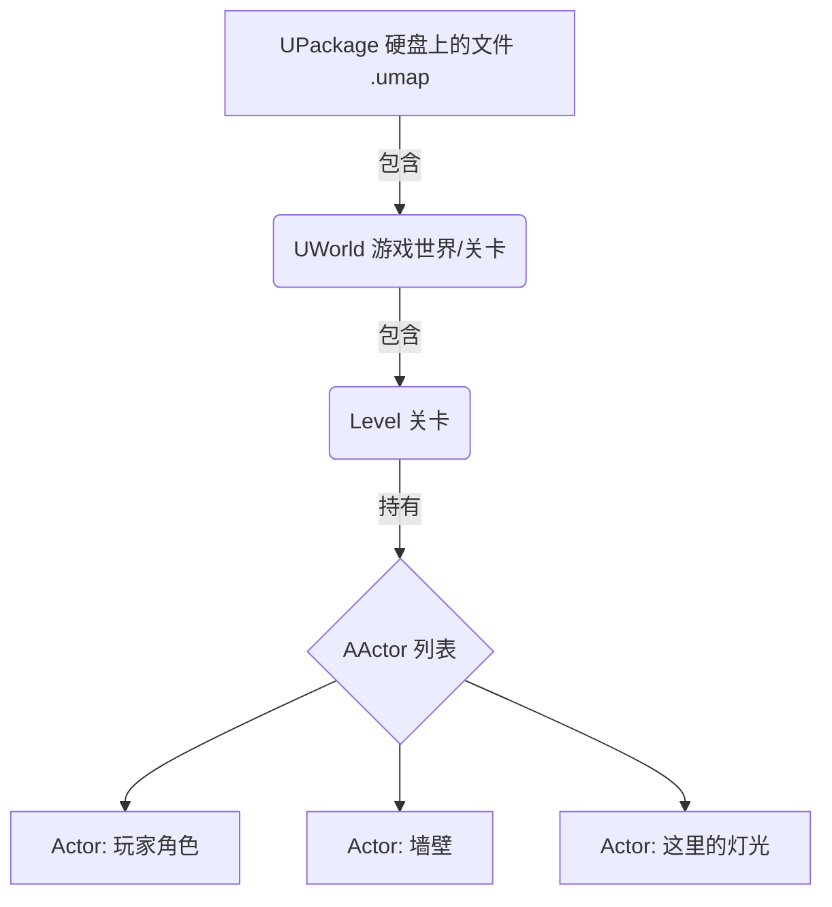

# UE5前置知识

在使用 UE5 之前需要学习的一些前置知识。

<!-- more -->

## 光照系统

UE5 的光照组件可以分为： **自然环境组** 和 **人工光源组**
- 自然环境组：
  - **Directional Light（定向光）**：模拟太阳光/月光，照亮整个场景，到达场景的所有光线都是 **平行** 的。
  - **Sky Light（天空光）**：模拟天空的漫反射光，补充阴影部分的光照。
  - **Atmospheric Fog（大气雾）**：模拟大气散射效果，增强远处物体的层次感。
  - **Sky Atmosphere（天空大气）**：用于创建逼真的天空和大气效果。
  - **Volumetric Clouds（体积云）**：用于创建逼真的云层效果。
- 人工光源组：
  - **Point Light（点光源）**：从一个点向各个方向发射光线，类似灯泡。
  - **Spot Light（聚光灯）**：从一个点向一个方向发射光线，类似手电筒。
  - **Rect Light（矩形光源）**：从一个矩形区域发射光线，适合模拟窗户或荧光灯。

## 字面量转换

在 UE5 编程中需要使用宏 [`TEXT()`](https://dev.epicgames.com/documentation/en-us/unreal-engine/epic-cplusplus-coding-standard-for-unreal-engine#generalstyleissues) 来将字符串字面量转换为 UE5 的 **Unicode** 字符串类型 `FString` 或 `FName`，以此避免不必要的编码转换。

## UE5 的核心继承树

> 继承时不要忘记把父类的函数也调用一下，因为本质上 **只是扩展父类的功能**。

下面的四种类型是 UE5 中最常用的四个核心类，每个类都有许多不同的派生类：
- UObject: 所有 UE5 对象的基类，提供了 **内存管理** 、 **垃圾回收** 等功能。 （不能放置）
- AActor: 继承自 UObject，是游戏世界中的实体对象，可以放置在关卡中。
- APawn: 继承自 AActor，是可以被“控制”的物体（比如载具、非人型生物）。
- ACharacter: 继承自 APawn，专门用于表示具有行走、跳跃等动作的角色，内置了角色运动组件。

## UE5 的包含体系

UE5 的包含体系也就是 UE5 管理资源的方式，主要是外部类及内部类的关系：
- Package: UE5 中的所有资源文件，可以理解成一个文件夹，包含了多个资源对象。
- World: 中间层，包含关卡（Level）和子关卡（Sublevel）。
- Level: 关卡，包含了场景中的所有 Actor 及 Actor 的组件。
  



## UE5 反射体系

在 UE5 引擎中，如果一个对象参与垃圾回收，系统就会追踪有多少变量在引用它。如果没有变量引用它，那这个对象就自动删掉了。如果在普通的 C++ 中，垃圾回收是自己实现的，如果自己忘记了就会造成内存泄漏。

UE5 引擎的类声明顶部有个 `UCLASS()` 宏，用于所有继承自 `UObject` 的类，这样每个类就能参与反射系统，参与了垃圾回收。

同理，要让变量和函数也参与到反射系统中，就得分别用 `UPROPERTY()` 和 `UFUNCTION()` 宏来声明。

```C++
UCLASS()
class AMyActor : public AActor
{
    GENERATED_BODY()
    
    UPROPERTY()
    UStaticMesh SwordMesh; // 参与反射系统的变量

    UFUNCTION()
    void Attack(); // 参与反射系统的函数
};
```
通过这些宏，才能够将这些变量和函数暴露给蓝图。

另外，使用反射系统的类一般都要包含头文件： `className.generated.h`

宏也可以传参数进去来改变宏的一些行为，从而改变变量和函数是如何暴露给蓝图的。
