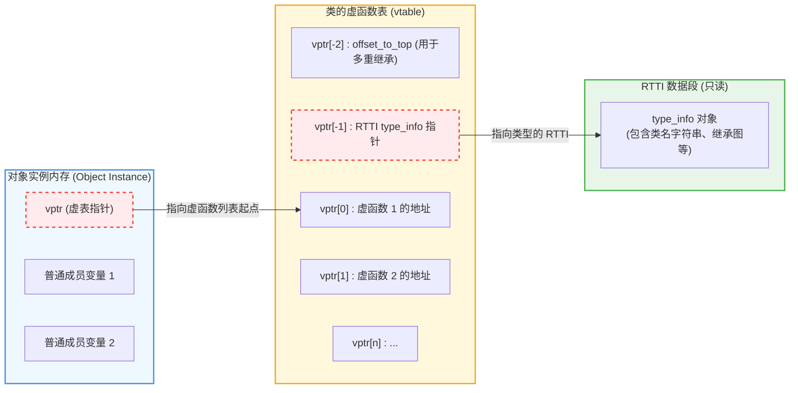
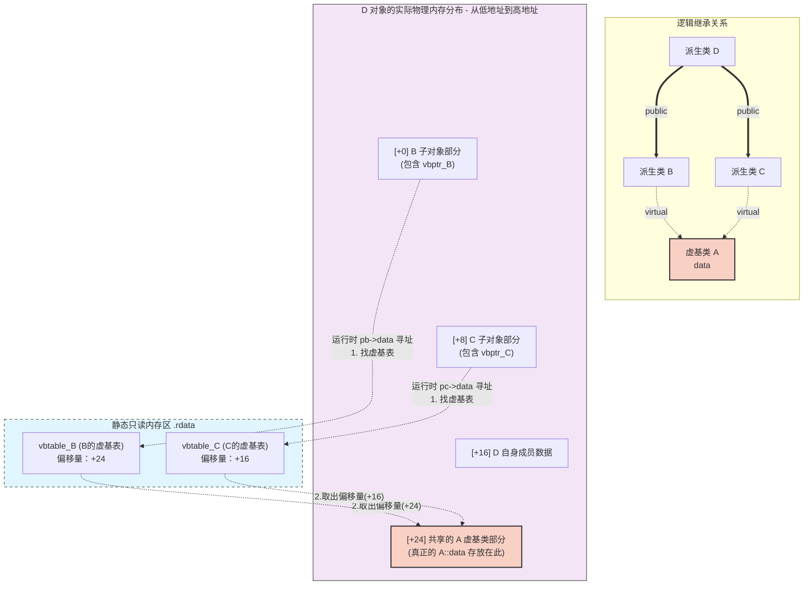

# 前言

虚函数是 C++ 实现多态的核心机制，理解虚函数的底层实现对于深入掌握 C++ 的面向对象特性非常重要。

<!-- more -->

## 虚函数

虚函数是指在基类中使用 `virtual` 关键字声明的成员函数。它允许在运行时根据对象的实际类型来调用相应的函数实现，从而实现**多态**。

对于虚函数，有几个特殊点需要记一下：
1. `inline` 可以是虚函数。 `inline` 只是一个建议，由编译器自行决定是否要展开函数，但是虚函数需要将函数地址存储在虚函数表中，而 `inline` 函数没有地址，因此 `inline` 和虚函数是矛盾的，编译器会忽略 `inline` 关键字。
2. `static` 函数不能是虚函数。静态成员函数没有 `this` 指针，且不属于任何对象
3. 构造函数不能是虚函数。在构造函数之前，虚表还未初始化，因此无法调用虚函数。
4. 析构函数可以是虚函数。虚析构函数可以确保在删除一个指向基类的指针时，能够正确调用派生类的析构函数，避免资源泄漏。

### 虚函数表（vtable）

虚函数表是在 **编译时** 由编译器为每个包含了虚函数的类生成的指针数组，数组存放的是类中每个虚函数的地址。

虚函数表存放的位置在 **内存的只读数据段(.rodata)** 即 **静态存储区** 中。

`vtable` 中不仅存储了虚函数的地址，还存储了 RTTI（Run-Time Type Information，运行时类型信息）相关的数据，以及 偏移量。
**RTTI 和 偏移量 用于 `dynamic_cast` 和 `typeid` 等运行时类型识别机制。**




对于 **次基类** （非头部的父类），在其对应的虚表中，存放的不是真正的子类虚函数地址，而是一小段被称为 **Thunk** 的特殊代码的地址。当调用发生时，这段 Thunk 代码会把当前指向对象中间的 this 指针减去一个偏移量，使其重新指向子类对象的头部，然后直接跳转（jmp）去执行子类真正的虚函数代码。

假如有两个父类 `A` 和 `B`，子类同时继承了 `A` 和 `B`，此时子类 `D` 的虚函数表其实是直接占了 子对象 `A` 的虚函数表的位置。同时父类 `B` 有一个虚函数 `funcB()` ，假设这样访问： `pb->funcB();` 其中 `pb` 是父类 `B` 的指针，调用路径是这样的：

1. 查表：用当前的 `pb` 指针（此时指向内存中间），找到 `B` 子对象的次级 `vptr`，访问次级虚表。
2. 获取地址：在次级中，获取到 **Thunk 代码的地址。**
3. 执行 Thunk 汇编代码：`this = this - offset; jmp funcB;`

:::info 注
此时这里的偏移量不用从虚表中查，在编译阶段是直接硬编码进 Thunk 代码中的。
:::

如果是重写的 `A` （头部的父亲）的虚函数，并用 `A` 的指针访问，则直接拿到虚表中真实的虚函数地址，而不用执行 Thunk 代码。（因为 `A` 在子对象空间中偏移量为 0）

### 虚表指针（vptr）

虚表指针是一个隐藏的指针，只有类中有虚函数才会有这个指针。虚表指针始终放在类内存空间的头部，指向该类的虚函数表。

`vptr` 只在构造函数中被初始化，将虚表地址赋值给 `vptr`，在对象的生命周期内保持不变。当子类派生父类时，在子类的构造函数中，会将 `vptr` 重新指向子类的虚函数表，以实现多态调用。

:::warning
`vptr` 并不是直接指向了 `vtable` 的首地址，而是指向 `vtable` 中的第一个函数的地址。
:::

虚表指针本质是一个指向指针（函数地址）的指针，假设有一个对象 `p` ，可以通过强制转换获得 `vptr` 指针：
```cpp
Base *p = new Derived();
intptr_t* vptr = *(intptr_t**)p;

// 假设存入的函数参量为 int a, int b, int c
typedef void (*FuncPtr)(Base*, int, int, int);

FuncPtr func = (FuncPtr)vptr[0]; // 获取虚函数表中第一个函数地址
FuncPtr func2 = (FuncPtr)vptr[1]; // 获取虚函数表中第二个函数地址

func(p, 1, 2, 3); // 调用虚函数
func2(p, 1, 2, 3); // 调用虚函数
```

`p` 为指向对象的指针，存入的是对象的地址，这个地址也是这个对象虚表指针的地址，将其转换成 `intptr_t**` 的类型，再解引用就可以得到 `vtable` 的地址，再将其赋值给另一个指针。

:::info
使用 `intptr_t` 是因为在 64 位系统下， `vptr` 为 8 字节，而在 32 位系统下为 4 字节，`int` 只有 4 字节，为了跨平台兼容，使用 `intptr_t` 来存储指针地址。
:::

## 虚继承

虚继承是为了解决菱形继承中，当一个类同时继承了两个父类，而这两个父类又继承自同一个祖先类时，可能会出现数据成员的二义性问题。虚继承通过在基类前加上 `virtual` 关键字来实现，确保在派生类中只有一份基类的实例，从而避免了二义性问题。

通过虚继承，让子类中只拷贝一份基类的成员数据，并存放在子类内存空间的后面。




### 虚基表

虚基表和虚表一样存放在静态存储区中，但是虚基表中只存偏移量，记录的是 **当前子对象指针（`vbptr`） 到共享虚基类内存块首地址的距离** 。

对于上面的例子，虚基表存在于父类 B 和 C 中，分别存储了偏移量 24 和 16，表示从 B 子对象和 C 子对象的起始地址到共享的 A 虚基类部分的距离。

然后就是看继承顺序，如果 D 先继承 B 再继承 C，那么在 D 对象的内存布局中，B 子对象部分会在前面，C 子对象部分在后面，最后从 D 的指针找基类成员时，就从 B 的虚基表中取出偏移量然后开始找。

### 虚基表指针

虚基表指针 `vbptr` 也是存放在类空间的头部，紧随 `vptr` 其后，只想虚基表。
