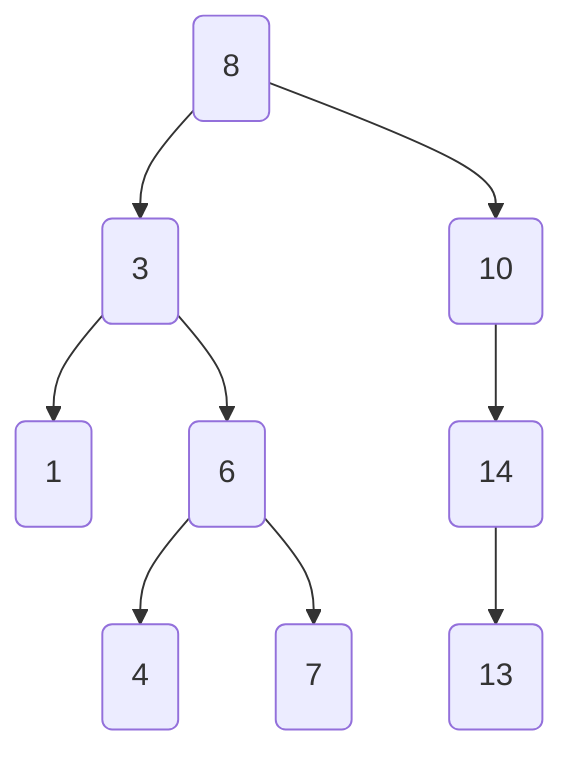
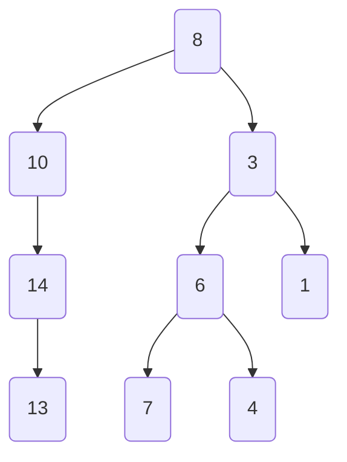
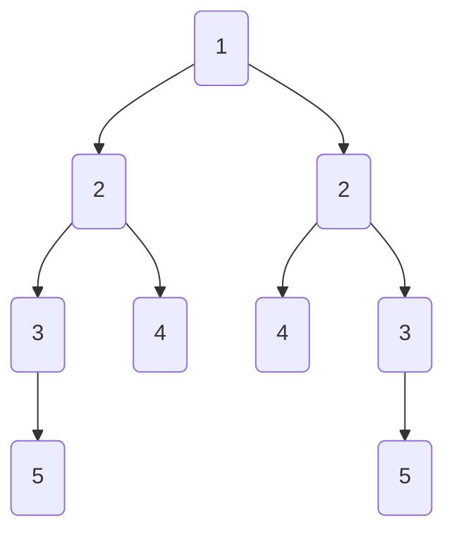

一些经典的关于二叉树的算法问题。

# 我脑子不转了，有什么头猪吗。

<!-- more -->

## 树区间元素搜索问题

比如在某一棵BST树中，输出区间为 `10~50` 之间的所有数。

区间内的节点就输出，如果在区间外就不用遍历了。

其实不用中序遍历也行，但是中序遍历输出就是有序的值。
```C++
void findValues(Node* node, int i, int j) {
    if (!node)
        return;
    // 中序遍历
    if (node->data_ > i)
        findValues(node->left_, i, j);   // L
    // V
    if (node->data_ <= j && node->data_ >= i) {
        cout << node->data_ << " ";
    }
    if (node->data_ < j)
        findValues(node->right_, i, j);   // R
}
void findValues(int i, int j) {
    findValues(root_, i, j);
    cout << endl;
}
```

## 判断一颗二叉树是否是BST树

利用 **中序遍历升序** 的特点，只要发现当前节点的值小于前一个节点的值，那就判断肯定不是BST树。

:::warning
不要用局部的 左孩子 < 根节点 < 右孩子 来判断是否是BST树，应该看全局。
:::

```C++
// 需要只用引用指针，否则更改指针也只是更改拷贝的指针，带不回上一层
static bool isBST(Node* node, Node* &pre) {
    if (!node)
        return true;
    if (!isBST(node->left_, pre))
        return false;
    // V
    Comp comp_; // typename Comp = less<T>
    // 第一次回程时pre指针依然是nullptr，此时跳过
    if (pre && comp_(node->data_, pre->data_)) {
        return false;
    }
    // 如果满足条件，更新当前正在遍历的父节点
    pre = node;
    // 进入右子树遍历
    return isBST(node->right_, pre);
}
```

## BST树求子树问题

判断子树是不是大树的一部分，判断是否有多余的节点。如果子树有节点而大树没有，说明该子树不是大树的子树。

```C++
bool isChildTree(BSTree<T>& child) {
    // 在当前二叉树上找child树的根节点
    if (!child.root_)
        return true;
    Node* cur = root_;
    // 找与子树根节点相同的节点
    while (cur) {
        if (cur->data_ == child.root_->data_) {
            break;
        } else if (comp_(cur->data_, child.root_->data_)) {
            cur = cur->right_;
        } else {
            cur = cur->left_;
        }
    }
    // 没找到
    if (!cur)
        return false;
    return isChildTree(cur, child.root_);
}
bool isChildTree(Node* father, Node* child) {
    if (!father && !child) {
        return true;
    } else if (father && !child) {
        // 大树有节点子树没有
        return true;
    } else if (!father && child){
        // 子树有节点大树没有
        return false;
    } else {
        // 大树和子树都有节点
        if (father->data_ != child->data_) {
            return false;
        }
        // if (!isChildTree(father->left_, child->left_)) {
        //     return false;
        // }
        // return isChildTree(father->right_,child->right_);
        // 上面那4行就直接浓缩成下面这一行
        return isChildTree(father->left_,child->left_) &&
            isChildTree(father->right_,child->right_);
    }
}
```

## 求LCA最近公共祖先节点

给定一棵二叉树（不一定是 BST），以及两个节点 p 和 q，它们的 **最近公共祖先（Lowest Common Ancestor, LCA）** 定义为：  
在树中同时拥有 p、q 作为后代（允许一个节点是它自身的后代）的最深的那个节点。

### 如何找到最近祖先节点？

两个节点的最小祖先节点，它们必定在祖先节点的两边。

```C++
int getLCA(int val1, int val2) {
    Node* p = getLCA(root_, val1, val2);
    if (!p)
        throw "No LCA!";
    return getLCA(root_, val1, val2)->data_;
}
Node* getLCA(Node* node, int val1, int val2) {
    if (!node)
        return nullptr;
    if (node->data_ < val1 && node->data_ < val2) {
        // 根节点均小于两数，说明最小祖先在右孩子
        return getLCA(node->right_, val1, val2);
    } else if (node->data_ > val2 && node->data_ > val2) {
        // 根节点均大于两数，说明最小祖先在左孩子
        return getLCA(node->left_, val1, val2);
    } else {
        // 找到LCA
        return node;
    }
}
```

## 二叉树镜像翻转问题

将一个二叉树或BST树照镜子一样翻转过来。


镜像后：


遍历根节点时，直接交换左右孩子即可。


```C++
  void mirror() {
      mirror(root_);
  }
  void mirror(Node* node) {
      if (!node)
          return;
      // v
      Node* p = node->left_;
      node->left_ = node->right_;
      node->right_ = node->left_;
      mirror(node->left_); // l
      mirror(node->right_);// r
  }
```

## 二叉树镜像对称问题

判断该树是否是对称的：



左右孩子都是相等的

```C++
bool isMirror() {
    return isMirror(root_,root_);
}
bool isMirror(Node* p, Node* q) {
    // 一直遍历到底都相等就返回true
    if (!p && !q) {
        return true;
    }
    if (!q || !p) {
        return false;
    }
    if (p->data_ != q->data_) {
        return false;
    }
    return isMirror(p->left_, q->right_) &&
            isMirror(p->right_, q->left_);

}
```

## 前序遍历和中序遍历重建二叉树

已知一棵二叉树的

前序遍历序列：`Pre = [ 根 | 左子树前序 | 右子树前序 ]`
中序遍历序列：`In  = [ 左子树中序 | 根 | 右子树中序 ]`

利用前序的 **“第一个一定是当前子树的根”** ，结合中序里根的位置能切出左右子树区间，从而递归重建整棵树。

因此：
- 前序遍历确定根。
- 中序确定哪个是左孩子哪个是右孩子。

前序的起始第 `i` 个元素就是分界点，在中序中确定左右子树的范围。

```C++
Node* rebuild(int pre[], int i, int j, int in[], int m, int n) {
    if (i > j || m > n) {
        // 当前创建完毕
        return nullptr;
}
// 创建当前子树的根节点
Node* root = new Node(pre[i]);
for (int k = m; k <= n; ++k) {
    if (in[k] == pre[i]) {
        root->left_ =
            rebuild(pre, i + 1, i + k - m, in, m, k - 1);
        root->right_ =
            rebuild(pre, i + k - m + 1, j, in, k + 1, n);
        return root;
    }
}
return root;
```

其中 `i` `j` `m` `n` 的含义：
- `i`：当前子树在前序数组 `pre` 中的起始下标（该位置元素就是当前子树根）。
- `j`：当前子树在前序数组中的结束下标（`[i..j]` 是这棵子树的完整前序片段，包含根 + 左子树 + 右子树）。
- `m`：当前子树在中序数组 `in` 中的起始下标。
- `n`：当前子树在中序数组中的结束下标（`[m..n]` 是这棵子树的完整中序片段）。

找到根值在中序中的位置 `k(m <= k <= n)`后：

假设已知了前序数组和中序数组：
- `pre = [58 24 0 5 34 41 67 62 64 69 78]`
- `in = [0 5 24 34 41 58 62 64 67 69 78]`

- 左子树节点个数 `k - m`
- 左子树：
    - 前序区间 `[i+1 .. i+k-m]`
    - 中序区间 `[m   .. k-1]`
- 右子树：
    - 前序区间 `[i+k-m+1 .. j]`
    - 中序区间 `[k+1 .. n]`


## 判断二叉树是否是平衡树

平衡树：任意节点的左右孩子的高度差不能超过1。

只有 **每一层** 的左右子树高度差都不超过1才行。

:::code-group
```C++ [常规写法]
bool isBalance() {
    bool is = true;
    isBalance(root_, 0, is);
    return is;
}
int isBalance(Node* node, int l, bool& is) {
    if (!node)
        return l;
    int left = isBalance(node->left_, l + 1, is);
    if (!is)
        return left;
    int right = isBalance(node->right_, l + 1, is);
    if (!is)
        return right;
    int diff = left >= right ? left - right : right - left;
    is = (diff <= 1) & is;
    // 返回最深层
    return left > right ? left : right;
}
```
```C++ [简洁写法]
bool isBanlance() {
    return isBanlance(root_) != -1;
}
int isBalance(Node* node) {
    if (!node)
        return 0;
    int lh = isBalance(node->left_);
    if (lh == -1) return -1;
    int rh = isBalance(node->right_);
    if (rh == -1) return -1;
    int diff = lh > rh ? lh - rh : rh - lh;
    if (diff > 1) {
        return -1;
    }
    return lh > rh ? lh + 1 : rh + 1;
}
```
:::

## 求BST树中序遍历的倒数第k个节点

中序VLR求倒数第k个 = **VRL** 求正数第k个。

VRL相当于VLR的倒序。


```C++
int getKVal(int k) {
    // 从1开始算
    int i = 0;
    Node* p = getKVal(root_, i, k);
    if (p)
        return p->data_;
    else {
        throw "no data";
    }
}
Node* getKVal(Node* node, int& n, int k) {
    if (!node)
        return nullptr;
    Node* nr = getKVal(node->right_, n, k);
    if (nr)
        return nr;
    // V
    if (++n == k) {
        return node;   // 在VRL下找到正数第k个
    }
    Node* nl = getKVal(node->left_, n, k);
    return nl ? nl : nr;
}
```

:::warning 在这里要注意

不能直接将临时值（右值）赋给非常量引用。要修改非常量引用的值，必须对引用本身执行 `++n`、`n += 1` 或 `n = n + 1`，而不是试图通过传递 `n+1` 达到“自增”效果。下面这段代码就是错误的。

```C++
Node* nr = getKVal(node->right_, n + 1, k); // [!code error]
```

const 左值引用 (const T&) 可以绑定到：
- 左值（可转换）
- 右值 / 临时对象 / 字面量 / 表达式结果（比如 n+1） 绑定后临时对象的生命周期被延长到该引用的作用域结束。

表达式 `n+1` 产生一个右值，没有名字；只有 `const T&` 或 `T&&` 能接它；`T&` 不行。

:::
