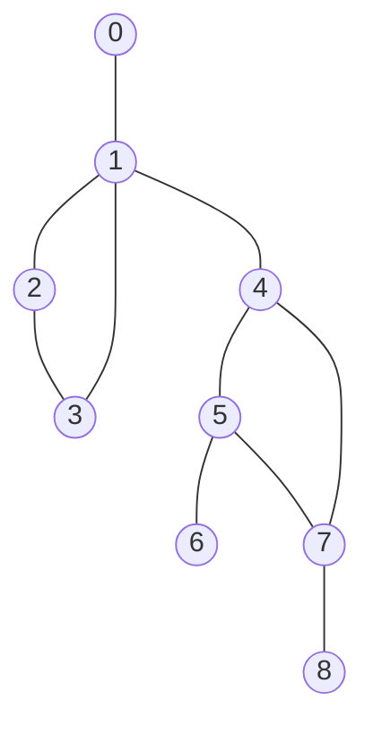

# 图神经网络

图神经网络（Graph Neural Network, GNN）是一类直接在图结构数据（节点 + 边）上进行表示学习的神经网络。它通过“消息传递 / 邻域聚合”机制，把每个节点自身特征与邻居特征迭代融合，得到包含局部结构语义的嵌入向量，供分类、预测或生成等任务使用。

<!-- more -->

## 基础预备

学习图神经网络有几个知识点必须了解：
- 投影
- 傅里叶变换
- 切比雪夫近似（Chebyshev approximation）

### 投影

通过所学的线性代数可知：在向量中，一个向量在另一个向量的投影就是一个向量与另一个向量的单位向量点积。其结果是一个 **标量**，表征该向量在基向量上的“影子”长度。

$$\vec{a} \cdot \vec{b}=|\vec{a}| \cdot|\vec{b}| \cdot \cos \theta$$

若 $\vec{b}$ 是单位向量，那么 $\vec{a} \cdot \vec{b}$ 就是向量 $\vec{a}$ 在**基向量** $\vec{b}$ 上的投影。

先复习一下矩阵内积：
设两个一维列向量矩阵 $x$ 和 $y$ ，则它们的内积为：
$$
x^\top y = \sum_{i=1}^n x_i y_i
$$

对于多维的矩阵之间的内积就是前一个矩阵的行向量与后一个矩阵的列向量作点积。

上面只是投影在一个基向量上，若是投影到二维向量乃至多维向量，此时可以使用矩阵来表示。每一个列向量都是一个基向量（它们相互正交）：

设： $U=[u_1\ u_2\ \dots\ u_k] \in \mathbb{R}^{n\times k}$，其中列向量两两正交且单位化：$U^\top U = I_k$。对任意 $x\in\mathbb{R}^n$：

则向量 $x$ 在空间 $U$ 上的投影为：

$$
\hat{x} = U^\top x = 
\begin{bmatrix}
u_1^\top x \\
u_2^\top x \\
\vdots\\
u_k^\top x 
\end{bmatrix}
$$

例如在坐标轴上：

设向量
$$
v=\begin{bmatrix}a\\ b\end{bmatrix},\qquad
e_x=\begin{bmatrix}1\\0\end{bmatrix},\quad
e_y=\begin{bmatrix}0\\1\end{bmatrix},\quad
U=[e_x\ e_y]
$$

则 $e_x$ $e_y$ 分别是 $x$ $y$ 轴上的基向量， $U$ 为向量空间。

对应的投影：
标量系数（在各基方向上的坐标）：
$$
\hat{v} = U^\top v =
\begin{bmatrix}
e_x^\top v\\
e_y^\top v
\end{bmatrix}
=
\begin{bmatrix}
a\\
b
\end{bmatrix}
$$

得到的结果是在每个基向量上的“影子长度”，则可以得到对应的投影向量，投影向量之和就能得到原来的向量，或者将“影子长度”直接乘上向量矩阵，就能恢复原来的向量。
分别的投影向量：
$$
\operatorname{proj}_{e_x}(v) = (e_x^\top v)e_x = ae_x \qquad
\operatorname{proj}_{e_y}(v) = (e_y^\top v)e_y = be_y
$$

向量恢复（重构）：
$$
v = \operatorname{proj}_{e_x}(v)+\operatorname{proj}_{e_y}(v)
= \begin{bmatrix}a\\0\end{bmatrix}+\begin{bmatrix}0\\b\end{bmatrix}
= \begin{bmatrix}a\\ b\end{bmatrix} 
= UU^{T}v
$$

### 傅里叶变换

傅里叶变换的核心思想：把信号表示成一组“振荡基”（正弦 / 余弦或复指数、在图上则是拉普拉斯特征向量）的线性组合；系数告诉我们每个“频率成分”有多强。

正向：
$$
X(\omega)=\int_{-\infty}^{+\infty} x(t)\, e^{-j\omega t}\,dt
$$
逆变换：
$$
x(t)=\frac{1}{2\pi}\int_{-\infty}^{+\infty} X(\omega)\, e^{j\omega t}\,d\omega
$$

#### 拉普拉斯算子

:::tip
在图中，拉普拉斯矩阵就是拉普拉斯算子的离散化！
:::

在离散空间中，相邻位置的差分推广到连续空间就是**导数**，则差分的差分，就是**二阶导数**。

在离散空间中，一阶差分写作（步长为常数的均匀网格）：
$$
\Delta f_i = f_{i+1}-f_i
$$
当步长 $h \to 0$ 时，差分商
$$
\frac{\Delta f_i}{h} = \frac{f_{i+1}-f_i}{h}
$$
趋近于连续一阶导数 $f'(x_i)$。

“差分的差分”（二阶差分）：
$$
\Delta^2 f_i = (f_{i+2}-f_{i+1}) - (f_{i+1}-f_i) = f_{i+2}-2f_{i+1}+f_i
$$
把索引平移写成更对称（中心）形式：
$$
\tilde{\Delta}^2 f_i = f_{i+1}-2f_i+f_{i-1}
$$
于是
$$
\frac{\tilde{\Delta}^2 f_i}{h^2} \approx f''(x_i),\quad h\to 0
$$

在连续 $d$ 维空间，拉普拉斯算子（Laplacian）为：
$$
\Delta f = \sum_{k=1}^d \frac{\partial^2 f}{\partial x_k^2}.
$$

取一个[“热传导的例子”](https://www.zhihu.com/question/54504471/answer/630639025)，对于一维的热传导：  
设一条均匀金属棒，被离散成 $n$ 个小段（节点）$i=1,\dots,n$，相邻段长度相同为 $h$，第 $i$ 段的温度记为 $\phi_i(t)$。只有相邻段之间传热，忽略内部热源，导热系数（热扩散率）记为 $\kappa>0$。

在很小时间内，节点 $i$ 的温度变化正比于“它与邻居温度差的总和”：
$$
\frac{d \phi_i}{dt} = \kappa(\phi_{i+1}-\phi_i) - \kappa(\phi_i-\phi_{i-1}).
$$

前一项是下一个单元向当前单元的热量流入使得温度升高，后一项是当前单元向上一个单元的热量使得温度降低。

将等式右边放到等式左边可得：

$$
\frac{d \phi}{dt} - \kappa [(\phi_{i+1}-\phi_i) - (\phi_i-\phi_{i-1})] = 0
$$

第二项是差分的差分，即为离散形式的二阶导：

$$
\frac{\partial \phi}{\partial t}-k \frac{\partial^{2} \phi}{\partial x^{2}}=0
$$

在高维的欧氏空间中，一阶导数为 **梯度** ，二阶导数则为 **拉普拉斯算子$\Delta$**

$$
\frac{\partial\phi}{\partial t}-k\Delta\phi=0
$$

---
**推广到图**

在上图中可以看出结点1只与结点0、2、4发生热交换，其邻居为0、2、4。推广到任意节点 $i$  中，它的温度随时间变化为：

$$
\frac{d \phi_{i}}{dt}=-k \sum_{j}A_{ij} \left( \phi_{i}- \phi_{j} \right)
$$

其中 $A$ 是这个图的邻接矩阵， $A_{ij}$ 表征结点 $i$ 和结点 $j$ 的连接关系，若它们相邻则  $A_{ij}=1$ 反之  $A_{ij}=0$ 。简化讨论，认定该图为无向图，则  $A_{ij}= $A_{ji}$$ ，且对角线上均为0。

运用乘法分配律可转化为：

$$
\begin{array}{l}\frac{d \phi_{i}}{dt}=-k \left[ \phi_{i} \sum_{j}A_{ij}- \sum_{j}A_{ij} \phi_{j} \right] \\ =-k \left[ deg \left( i \right) \phi_{i}- \sum_{j}A_{ij} \phi_{j} \right] \end{array}
$$

其中 $\boldsymbol{deg(\cdot)}$ 表示这个结点的度。  
第一项是对结点 $i$ 的边求和，即求结点 $i$ 的度，第二项是结点 $i$ 与邻居结点的温度做内积。  
对于所有的结点的温度写成向量形式时，则变成：

$$
\begin{bmatrix}
\frac{d\phi_1}{dt} \\
\frac{d\phi_2}{dt} \\
\cdots \\
\frac{d\phi_n}{dt}
\end{bmatrix}=-k
\begin{bmatrix}
deg(1)\times\phi_1 \\
deg(2)\times\phi_2 \\
\cdots \\
deg(n)\times\phi_n
\end{bmatrix}+kA
\begin{bmatrix}
\phi_1 \\
\phi_2 \\
\cdots \\
\phi_n
\end{bmatrix}
$$

定义向量 $\phi=\left[\phi_{1},\phi_{2},\ldots,\phi_{n}\right]^{T}$ ，则有：

$$\frac{d\phi}{dt}=-kD\phi+kA\phi=-k(D-A)\phi$$

其中 $D$ 矩阵表示度矩阵，只有对角线有值且值为对应结点 $i$ 的度。  
令 $L=D-A$ ，则有：

$$\frac{d\phi}{dt}=-kL\phi$$

与一维的微分方程对比：

$$\frac{\partial\phi}{\partial t}=k\Delta\phi$$

二者之间是一样的形式，因此可以把 $L$ 类比成 $\Delta$ 即 $L$ 类比成拉普拉斯算子。  
这里的 $L$ 就叫做 **拉普拉斯矩阵**。

因此在图中求结点的变化量，可以用拉普拉斯矩阵来计算。

#### 傅里叶计算推广到图

在欧氏空间中，可以计算拉普拉斯算子 $\Delta$ 的特征函数：

$$
\Delta e^{-j \omega t}= \omega^{2}e^{-jwt}
$$

则 $\omega^{2}$ 为 拉普拉斯算子 $\Delta$ 的特征值， $e^{-jwt}$ 就是特征函数。  
类比到图中，则有：

$$
LU^{\top} = \Lambda U^{\top}
$$

其中 $U^{\top}$ 为 $L$ 的特征矩阵， $\Lambda$ 为 $L$ 的特征值矩阵，且 $U$ 满足列向量相互正交（相互正交才能作为一个基向量）。

因此在图中，对 $U$ 的投影类比于欧氏空间中对 $e^{-j\omega t}$ 上的投影。  
而傅里叶变换本质是 $x(t)$ 到正交基 $e^{-j\omega t}$ 的投影，那么在图上的傅里叶比那换就是 对正交基（向量矩阵） $U$ 的投影，即矩阵 $U^{\top}$ 乘上 要投影的向量。

$\Lambda$ 矩阵中 $\lambda_k$ 是对应的“频率刻度”，表示在每个向量随图信号结构的变化强度。  
- $\lambda_k$ 越小则对应的“频率分量 $u_k$ ”变化越缓慢，邻接结点取值差异小，对应于“低频”。
- $\lambda_k$ 越大则对应的“频率分量 $u_k$ ”变化越陡峭，邻接结点取值差异大，对应于“高频”。

因此就有，对于正变换中，相当于求 $x(t)$ 到正交基 $e^{-j\omega t}$ 的投影，推广到图上的正交基则可以用 `laplace` 矩阵的特征向量。

则正变换为：

$$
X=U^{\top}x
$$

---
**对于反变换**

傅里叶变换是对正交基的投影，那么反变换就是从投影钟恢复回来，因此只要乘上正交基矩阵即可恢复原来的向量，则反变换为：

$$
x=UX
$$

### 切比雪夫近似

要求图的卷积，则可以利用图的傅里叶变换，把结点变换到“频域”，再与卷积核相乘，最后再变换回去。  

对于图的卷积中，在“频域”中可以设一个卷积核为：

$$
g_\theta(\Lambda)=\operatorname{diag}(g_\theta(\lambda_0),\ldots,g_\theta(\lambda_{k-1}))
$$

就是对每一个“频率分量”的 **缩放系数（ $\lambda_k$ ）** 做欧氏空间中频率响应相同的作用（不同的 $\lambda$ 看作欧氏空间不同维度下的 $\omega$）。  
不同的 $g_{\theta}(\lambda_{k})$ 就是不同“频率分量”下的“频率响应函数”。

由于直接计算图拉普拉斯的特征分解代价高，  
通常使用 **切比雪夫近似** 来逼近这一频率响应函数：  
$g_\theta(\Lambda) \approx \sum_{j=0}^{K} \theta_j T_j(\tilde{\Lambda})$

其中  
- $T_j(\cdot)$ 为第 $j$ 阶切比雪夫多项式，
- $\tilde{\Lambda}=\frac{2}{\lambda_{max}}\Lambda-I_{N}$ 是归一化后的拉普拉斯特征值矩阵。
- $K$ 表示 $K^{th}$ 次 Laplacian。

这种近似能避免显式特征分解，  
并保持图卷积在节点域中的局部化计算。

## 图卷积网络

根据上述式子，图卷积可以表达为：

$$
g_\theta*x=Ug_\theta U^Tx
$$

其中 $x$ 对应图中的结点。  
利用切比雪夫近似：
$$
\approx U \sum_{k=0}^K \theta_k T_k(\tilde{\Lambda}) U^T x
$$

$$
= \sum_{k=0}^K \theta_k T_k(U \tilde{\Lambda} U^T) x
$$

$$
= \sum_{k=0}^K \theta_k T_k(\tilde{L}) x
$$

其中  
$$
\tilde{L} = \dfrac{2}{\lambda_{\max}} L - I_N
$$

---

在论文中传播层数取 $k=1$，并设 $\lambda_{\max}=2$，得到：
$$
g_\theta * x = \sum_{k=0}^1 \theta_k T_k(\tilde{L}) x
$$
$$
= \theta_0 T_0\!\left(\frac{2}{2}L - I_N\right)x
 + \theta_1 T_1\!\left(\frac{2}{2}L - I_N\right)x
$$
$$
= \theta_0 x + \theta_1 (L - I_N)x
$$
$$
= \theta_0 x + \theta_1 \left(D^{-\frac{1}{2}} A D^{-\frac{1}{2}} - I_N\right) x
$$
$$
= (\theta_0 - \theta_1) x + \theta_1 D^{-\frac{1}{2}} A D^{-\frac{1}{2}} x
$$

---
为防止过拟合并减少参数，令  
$$
\theta = \theta_0 = -\theta_1
$$
得到：
$$
g_\theta * x = \theta \left( I_N + D^{-\frac{1}{2}} A D^{-\frac{1}{2}} \right) x
$$

---
令  
$$
\tilde{A} = I_N + A, \quad
\tilde{D}_{ii} = \sum_j \tilde{A}_{ij}
$$

最终形式：
$$
g_\theta * x = \theta \left( \tilde{D}^{-\frac{1}{2}} \tilde{A} \tilde{D}^{-\frac{1}{2}} \right) x
$$

在最后加上激活函数 $\sigma(\cdot)$ 得到：

$$
f(H^{(l)},A)=\sigma(\hat{D}^{-\frac{1}{2}}\hat{A}\hat{D}^{-\frac{1}{2}}H^{(l-1)}W^{(l)})
$$

其中：
- $H^{(l-1)}$ 对应 $x$
- $W^{(l)}$ 对应 $\theta$

最终这个式子就是我们要得到的图卷积结点参数更新公式，也就是原来的结点与卷积核卷积后得到的新值。